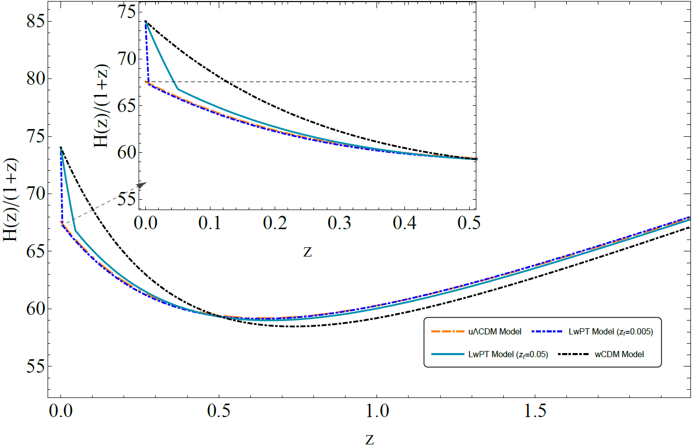

# A w phantom transition at zt<0.1 as a resolution of the Hubble tension

This is the repository that contains the Mathematica code as well as useful comments that reproduce the figures of [arxiv:2012.13932](https://arxiv.org/abs/2012.13932).

## Abstract
A rapid transition of the dark energy equation of state parameter  at a transition redshift  from  at  to  at  can lead to a higher value of the Hubble constant while closely mimicking a Planck18/CDM form of the comoving distance  %3D%5Cint_0%5E%7Bz%7D%5Cfrac%7Bdz'%7D%7BH(z')%7D%24) for . Such a Late $w$ Phantom Transition (LPT) avoids the discontinuity of %24) suggested in previous studies and thus does not require a step in the Pantheon Hubble diagram which is strongly constrained. We demonstrate that such a ultra low  abrupt feature of %24) provides a better fit to cosmological data compared to smooth late time deformations of %24).  The strongly present day phantom dark energy behavior implied by this class of models hints towards a rapid approach of a Big Rip singularity which for  will rip the universe in less than 3.5 billion years. Early hints of such effect may be observable in the dynamics of the nearest and largest bound systems (eg Virgo structures). The LPT can be generically induced by a phantom scalar field frozen by Hubble friction mimicking the cosmological constant and currently entering its ghost instability phase as Hubble friction decreases below the field dynamical scale.

## Citing the paper 
If you use any of the above codes or the figures in a published work please cite the following paper:
 *A w phantom transition at zt<0.1 as an approach to the Hubble tension*
 George Alestas, Lavrentios Kazantzidis and Leandros Perivolaropoulos, [arxiv:2012.13932](https://arxiv.org/abs/2012.13932)

Any further questions/comments are welcome.

## Authors List
George Alestas - <g.alestas@uoi.gr>
 Lavrentios Kazantzidis - <l.kazantzidis@uoi.gr>
 Leandros Perivolaropoulos - <leandros@uoi.gr>
