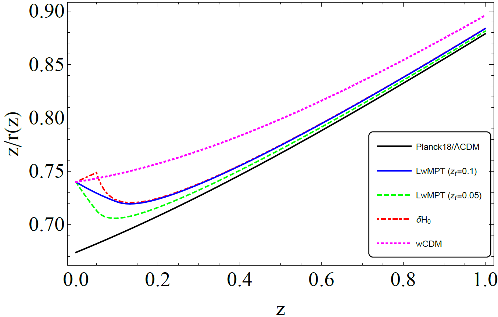

# A w - M phantom transition at zt<0.1 as a resolution of the Hubble tension

This is the repository that contains the Mathematica code as well as useful comments that reproduce the figures of [arxiv:2012.13932](https://arxiv.org/abs/2012.13932).

## Abstract
A rapid phantom transition of the dark energy equation of state parameter $w$ at a transition redshift $z_t<0.1$ of the form $w(z)=-1+\Delta w\;\Theta (z_t-z)$ with $\Delta w<0$ can lead to a higher value of the Hubble constant while closely mimicking a Planck18/$\Lambda$CDM form of the comoving distance  $r(z)=\int_0^z\frac{dz'}{H(z')}$ for $z>z_t$. Such a transition however would imply a significantly lower value of the SnIa absolute magnitude $M$ than the value $M_C$ imposed by local Cepheid calibrators at $z<0.01$. Thus, in order to resolve the $H_0$ tension it would need to be accompanied by a similar transition in the value of the SnIa absolute magnitude $M$ as $M(z)=M_C+\Delta M \;\Theta (z-z_t)$ with $\Delta M<0$. This is a Late $w-M$ phantom transition ($LwMPT$). It may be achieved by a sudden reduction of the value of the normalized effective Newton constant $\mu=G_{\rm{eff}}/G_{\rm{N}}$ by about $6\%$ assuming that the absolute luminosity of SnIa is proportional to the Chandrasekhar mass which varies as $\mu^{-3/2}$. We demonstrate that such an ultra low $z$ abrupt feature of $w-M$ provides a better fit to cosmological data compared to smooth late time deformations of $H(z)$ that also address the Hubble tension. For $z_t=0.02$ we find $\Delta w\simeq -4$, $\Delta M \simeq -0.1$. This model also addresses the growth tension due to the predicted lower value of $\mu$ at $z>z_t$. A prior of $\Delta w=0$ (no $w$ transition) can still resolve the $H_0$ tension with a larger amplitude $M$ transition with $\Delta M\simeq -0.2$ at $z_t\simeq 0.01$. This implies a larger reduction of $\mu$ for $z>0.01$ (about $12\%$). The $LwMPT$ can be generically induced by a scalar field non-minimally coupled to gravity with no need of a screening mechanism since in this model $\mu=1$ at $z<0.01$.

## Citing the paper 
If you use any of the above codes or the figures in a published work please cite the following paper:
 *A w - M phantom transition at zt<0.1 as an approach to the Hubble tension*
 George Alestas, Lavrentios Kazantzidis and Leandros Perivolaropoulos, [arxiv:2012.13932](https://arxiv.org/abs/2012.13932)

Any further questions/comments are welcome.

## Authors List
George Alestas - <g.alestas@uoi.gr>
 Lavrentios Kazantzidis - <l.kazantzidis@uoi.gr>
 Leandros Perivolaropoulos - <leandros@uoi.gr>
